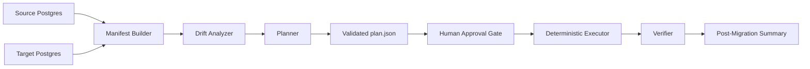

# Agentic DB Migration Orchestrator

[](https://github.com/atulk1000/agentic-db-migrator/actions/workflows/ci.yml)

An approval-gated database migration orchestrator for PostgreSQL with a CLI workflow, a browser dashboard, deterministic execution, and optional LLM planning adapters.

This repo is built around one core idea:

- the planner recommends
- the executor enforces

That separation matters. It means you can experiment with heuristic, hosted-demo, Gemini, or OpenAI planners without giving a model direct authority over mutation, DDL, or cutover behavior.



## Why This Repo Is Interesting

This is not just a one-shot migration script. The repo already includes the pieces you would expect from a more serious migration platform:

- source and target discovery
- deterministic drift analysis
- plan generation with strict schema validation
- human review and approval before mutation
- resumable execution with checkpoint state
- verification and post-migration reporting
- browser-based demo/testing workflow
- Dockerized local demo stack
- scaffolding for large-table and partition-aware transfers

It was inspired by a real-world need: replicating large Postgres datasets and partitioned structures reliably into QA or higher environments when naive copy approaches and many off-the-shelf tools are not enough.

## Reviewable Example Artifacts

The [`examples/approval_workflow`](examples/approval_workflow) folder contains checked-in sample artifacts so reviewers can inspect the workflow without running a database:

- `source_manifest.json`
- `target_manifest.json`
- `manifest_diff.json`
- `plan.json`
- `pre_migration_summary.json`
- `approval.json`
- `state.json`
- `verification_report.json`
- `post_migration_summary.md`

These files demonstrate the audit trail the project is designed to produce: what was discovered, what changed, what was approved, what ran, and what verified cleanly.

The [`examples/llm_run`](examples/llm_run) folder shows the AI-facing artifact chain:

- `llm_raw_response.json`
- `repaired_plan.json`
- `validated_plan.json`
- `approval.json`
- `post_migration_summary.md`

That example is meant to answer a practical reviewer question: what did the model contribute, and how did deterministic validation constrain it?

## What The Repo Supports Today

The strongest current path is Postgres-to-Postgres migration with:

- table discovery and metadata extraction
- partition-aware DDL recreation
- partition fidelity verification
- foreign keys and indexes
- schema and relation grants
- UDF recreation
- materialized views, including staged rebuild support
- rowcount and optional sample-hash verification
- post-migration `ANALYZE` / `VACUUM ANALYZE`
- approval-gated execution
- optional Streamlit UI for browser-based testing

The codebase also includes experimental or evolving support/scaffolding for:

- `spark_jdbc` transfer planning
- geometry-aware metadata for PostGIS-heavy tables
- hosted demo planner endpoints
- shared normalization/validation logic for LLM planner outputs

## Core Workflow

The main workflow is:

1. `analyze`
2. `review`
3. `approve`
4. `run`
5. `summarize-post`

This is the recommended path for both heuristic and LLM planning because it separates read-only analysis from mutation.

### What Each Step Produces

- `analyze`
  - discovers both source and target
  - writes `source_manifest.json` and `target_manifest.json`
  - computes `manifest_diff.json`
  - generates `plan.json`
  - produces `pre_migration_summary.json`
- `review`
  - renders the pre-migration summary for human inspection
- `approve`
  - creates `approval.json` with the approved mode, scope, and destructive-policy choices
- `run`
  - executes only the approved subset of the plan
- `summarize-post`
  - produces a final post-migration summary from the plan, state file, and optional verification report

## Why This Is Better Than Direct Execute

The repo still exposes lower-level commands, but the approval-gated flow is stronger because it adds:

- source-vs-target drift analysis before transfer
- preflight warnings and manual-review routing
- explicit migration modes
- audit-friendly approval artifacts
- scoped execution by approved tables
- post-migration summaries instead of only raw logs

## Planner Backends

The CLI and browser UI accept:

- `heuristic`
- `demo`
- `gemini`
- `openai`

Current behavior:

- `heuristic` is real and deterministic
- `demo` can call a hosted planner endpoint you control and otherwise falls back safely
- `gemini` is a real live planner path when `GEMINI_API_KEY` is configured; it receives the source manifest, manifest diff, and migration objective
- `openai` is a real live planner path when `OPENAI_API_KEY` is configured; it uses the same prompt contract, drift context, validation, and fallback boundary as Gemini

All LLM-backed planner paths are expected to go through the same safety gate:

- provider-specific API call
- shared prompt contract and normalization/repair of common model mistakes
- strict plan validation
- heuristic fallback if the output is still invalid

## AI Planning Evidence

The AI layer is deliberately structured and inspectable:

- the active Gemini/OpenAI prompt is versioned in [`src/amo/core/planners/prompts/migration_planner_v1.md`](src/amo/core/planners/prompts/migration_planner_v1.md)
- Gemini and OpenAI planning receive both source metadata and drift context during `analyze`
- model output is normalized through [`llm_common.py`](src/amo/core/planners/llm_common.py)
- every accepted plan is validated against strict Pydantic schemas before execution
- invalid or unavailable model output falls back to the deterministic heuristic planner

Run planner evals with:

```powershell
python evals/run_planner_eval.py --planner heuristic
python evals/run_planner_eval.py --planner gemini
python evals/run_planner_eval.py --planner openai
```

The eval report tracks:

- schema-validation pass rate
- fallback count
- forbidden operation usage
- required table coverage
- required verification behavior
- partition-fidelity behavior

Saved eval cases live in [`evals/cases`](evals/cases), and the latest checked-in example report is [`evals/latest_eval_report.json`](evals/latest_eval_report.json).

## Safety Boundary

The project is designed so model output can influence planning, but deterministic code owns execution.

| Area | Planner / LLM adapter can do | Deterministic code enforces |
| --- | --- | --- |
| Table ordering | Recommend copy order and priorities | Validate allowed operations in `plan.json` |
| Transfer strategy | Suggest full copy, chunked copy, or partition-wise copy | Execute only supported plan ops |
| Chunking | Recommend chunk columns and counts | Verify columns exist and remain schema-bound |
| Verification | Recommend rowcount or sample-hash depth | Run verifier against source and target |
| Risk handling | Flag warnings and manual-review items | Require explicit approval before execution |
| SQL execution | No free-form SQL authority | Executor builds allowlisted DDL/COPY operations |

## Large-Migration Features

The repo already includes first-class support or structured scaffolding for:

- `spark_jdbc` execution mode for large-table movement
- transfer hints like chunk column and chunk count
- geometry-aware metadata for PostGIS-heavy tables
- staged materialized view rebuilds
- grants discovery and replay
- partition replication fidelity checks
- post-migration maintenance steps

These are emitted as structured plan steps or hints, so they stay inside the same approval and execution boundary.

## Demo Paths

There are three practical ways to demo the project.

### 1. Fastest CLI Demo

Use the approval-gated flow against the local Docker Postgres pair:

```powershell
python -m amo.cli analyze --config config.yaml --planner heuristic --out-dir runs\analysis_demo
python -m amo.cli review --summary runs\analysis_demo\pre_migration_summary.json
python -m amo.cli approve --plan runs\analysis_demo\plan.json --summary runs\analysis_demo\pre_migration_summary.json --mode safe_sync --out runs\analysis_demo\approval.json
python -m amo.cli run --config config.yaml --plan runs\analysis_demo\plan.json --approval runs\analysis_demo\approval.json
python -m amo.cli summarize-post --plan runs\analysis_demo\plan.json --state runs\state_YYYYMMDD_HHMMSS.json --pre-summary runs\analysis_demo\pre_migration_summary.json --out runs\analysis_demo\post_migration_summary.json
```

### 2. Browser Demo

A lightweight Streamlit dashboard is included in [`streamlit_app.py`](streamlit_app.py).

Install the UI dependency:

```powershell
pip install -e .[ui]
```

Launch it:

```powershell
streamlit run streamlit_app.py
```

The browser UI is not a separate migration engine. It drives the same underlying project functions as the CLI and is intended to make the full workflow easier to inspect:

- analyze
- review
- approve
- run
- summarize-post

Key labels in the UI map to CLI artifacts:

- `Migration Plan File` -> `plan.json`
- `Run State File` -> execution state produced during `run`
- `Pre-Migration Summary File` -> `pre_migration_summary.json`
- `Verification Report File (Optional)` -> standalone `verify` output if present
- `Post-Migration Summary Output File` -> final summary written by the UI

### 3. Hosted Demo Planner

If you want a low-friction public demo without distributing provider credentials, use the `demo` planner and point it at a hosted planner endpoint:

```powershell
$env:DEMO_PLANNER_URL="https://your-demo-planner.example.com/plan"
```

That endpoint is expected to receive the manifest and return a valid plan object or `{ "plan": ... }`.

## Containerized Demo Stack

The repo includes:

- [`docker-compose.yml`](docker-compose.yml)
- [`Dockerfile`](Dockerfile)

Current Docker services:

- `source-db`
  - seeded Postgres source database
- `target-db`
  - empty Postgres target database
- `migrator`
  - app container built from the repo and configured to launch the Streamlit workflow dashboard

Bring the stack up with:

```powershell
docker compose up -d --build
```

Open the browser dashboard at:

```text
http://localhost:8501
```

You can still run CLI commands through the same image:

```powershell
docker compose run --rm migrator python -m amo.cli analyze --config config.yaml --planner heuristic --out-dir runs/analysis_demo
```

## Quickstart

### Prerequisites

- Docker Desktop
- Docker Compose
- Python 3.10+

### Local Setup

```powershell
docker compose up -d

python -m venv .venv
.\.venv\Scripts\Activate.ps1

pip install -e .

Copy-Item config.example.yaml config.yaml
Copy-Item .env.example .env
```

### Hosted LLM Planner Paths

If you want to use Gemini locally:

```powershell
$env:GEMINI_API_KEY="your-key-here"
python -m amo.cli analyze --config config.yaml --planner gemini --out-dir runs\analysis_gemini
```

If you want to use OpenAI locally:

```powershell
$env:OPENAI_API_KEY="your-key-here"
$env:OPENAI_MODEL="gpt-4.1-mini"
python -m amo.cli analyze --config config.yaml --planner openai --out-dir runs\analysis_openai
```

Provider API keys should stay local in `.env` or your shell environment. Do not commit real API keys.

## Low-Level Commands

These still exist for debugging and development:

```powershell
python -m amo.cli discover --config config.yaml --database source --out source_manifest.json
python -m amo.cli discover --config config.yaml --database target --out target_manifest.json
python -m amo.cli plan --manifest source_manifest.json --planner heuristic --out plan.json
python -m amo.cli run --config config.yaml --plan plan.json
python -m amo.cli verify --config config.yaml --plan plan.json --out report.json
```

## Migration Modes

The approval artifact supports:

- `full_refresh`
- `missing_only`
- `metadata_diff_only`
- `data_diff_only`
- `safe_sync`
- `plan_only`

`plan_only` is analysis-only and cannot be executed.

## Artifacts

The main workflow writes a reusable artifact set:

- `source_manifest.json`
- `target_manifest.json`
- `manifest_diff.json`
- `plan.json`
- `pre_migration_summary.json`
- `approval.json`
- `state.json` or timestamped state files
- `report.json`
- `post_migration_summary.json`

These make the process auditable, reviewable, and resumable.

## Safety Model

This project is AI-assisted, not AI-autonomous.

- plans are validated against strict schemas
- execution uses allowlisted operations
- destructive actions require explicit approval
- approval can scope execution to specific tables
- manual-review items are surfaced before execution
- the executor never runs arbitrary free-form model SQL

## Project Structure

```text
src/amo/
  cli.py
  core/
    analysis.py
    config.py
    executor.py
    manifest_builder.py
    policy.py
    verifier.py
    workflow_models.py
    planners/
      gemini.py
      heuristic_planner.py
      llm_common.py
      llm_stub.py
      models.py
      openai.py
      prompting.py
      prompts/
        migration_planner_v1.md
      remote_demo.py
  engines/
    base.py
    copy_engine.py
    spark_engine.py
  migration/
    introspect.py
    transfer.py
streamlit_app.py
tests/
  test_analysis.py
  test_cli_plan.py
  test_cli_workflow.py
  test_gemini_planner.py
  test_heuristic_planner.py
  test_openai_planner.py
  test_remote_demo_planner.py
  test_verifier.py
archive/
  v1/
evals/
  cases/
  run_planner_eval.py
examples/
  approval_workflow/
  llm_run/
```

Notes:

- `src/amo/core/` is the main current implementation path
- `src/amo/engines/` and `src/amo/migration/` are useful supporting or evolving modules
- `archive/v1/` preserves the earlier lineage without keeping it on the active path

## Current Scope and Honest Limitations

What is strong today:

- approval-gated Postgres-to-Postgres workflow
- browser + CLI demoability
- deterministic executor boundary
- partition-aware planning/execution
- structured artifacts and summaries
- live Gemini planner path when configured with `GEMINI_API_KEY`
- live OpenAI planner path when configured with `OPENAI_API_KEY`
- planner eval scaffolding and checked-in LLM artifacts

What is still evolving:

- `spark_jdbc` support is scaffolded but not yet battle-hardened
- Streamlit is a lightweight workflow dashboard, not a polished product UI
- the eval suite is intentionally small and should grow with more migration edge cases

## Testing

Run the local checks with:

```powershell
python -m compileall src tests
python -m pytest -q
python evals/run_planner_eval.py --planner heuristic
python evals/run_planner_eval.py --planner openai
```

Format and lint before publishing:

```powershell
black src tests streamlit_app.py
isort src tests streamlit_app.py
ruff check src tests streamlit_app.py
```

The repo also includes `.gitattributes` and formatter settings in `pyproject.toml` so Python, Markdown, YAML, TOML, and JSON files render cleanly in GitHub review.

## Roadmap

- harden the hosted demo planner with retries, repair, and better telemetry
- deepen `spark_jdbc` execution behavior for chunked and partition-wise transfer
- improve PostGIS conversion handling for non-native transfer paths
- expand diffing and verification depth
- add planner evals and fallback-rate tracking
- extract dialect adapters for additional databases
