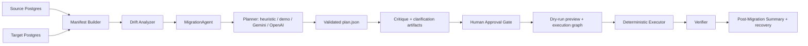
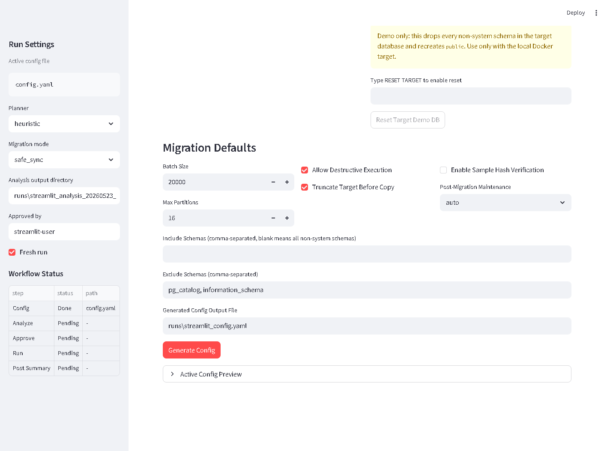
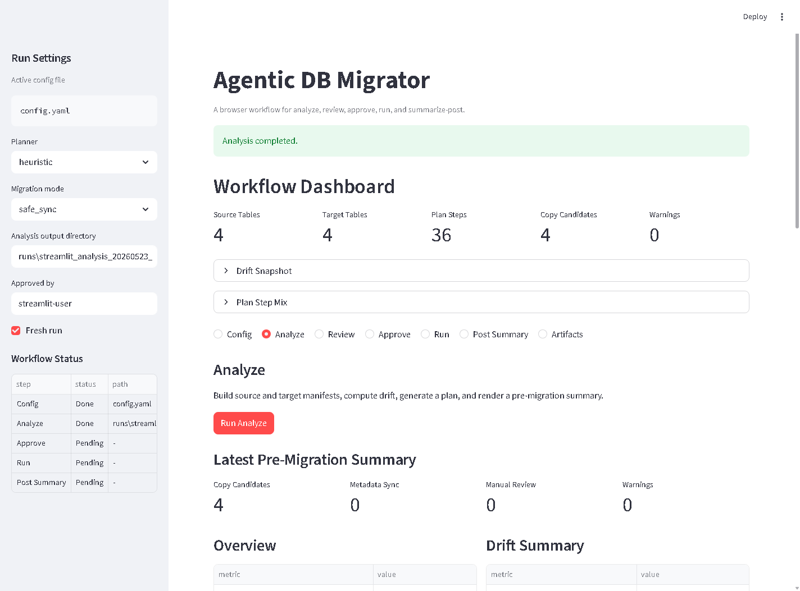
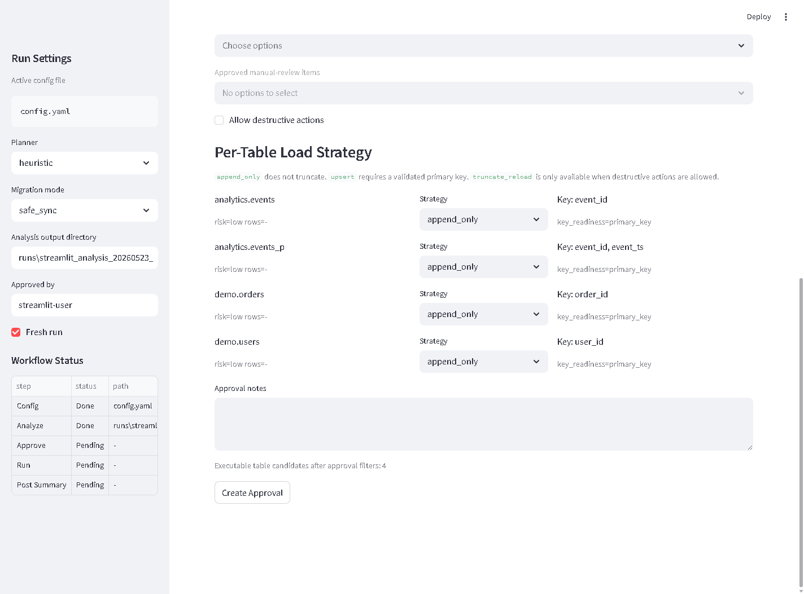

# Agentic DB Migration Orchestrator

[](https://github.com/atulk1000/agentic-db-migrator/actions/workflows/ci.yml)

An approval-gated AI migration agent for PostgreSQL. The project coordinates source/target observation, deterministic or LLM-backed planning, critique, human approval, dry-run validation, allowlisted execution, verification, and recovery artifacts.

This repo is built around one core idea:

- the planner recommends
- the human approves an exact artifact set
- the deterministic executor validates and enforces that approval

That separation matters. It means you can experiment with heuristic, hosted-demo, Gemini, or OpenAI planners without giving a model direct authority over mutation, DDL, or cutover behavior.

The agent runtime boundary is explicit in [`src/amo/core/agent.py`](src/amo/core/agent.py): `MigrationAgent` coordinates the bounded loop while existing planner, policy, executor, verifier, and analysis modules keep their focused responsibilities.

## Three-Minute Reviewer Path

1. Open [`examples/approval_workflow/approval.json`](examples/approval_workflow/approval.json) and confirm it binds the plan, summary, and source manifest by SHA-256.
2. Open [`src/amo/core/policy.py`](src/amo/core/policy.py) to see integrity validation, trusted metadata hydration, approval filtering, and retry-scope enforcement.
3. Open [`src/amo/core/executor.py`](src/amo/core/executor.py) to see the approved-bundle-only execution boundary and plan-bound checkpoint state.
4. Run `python -m pytest -q -m "not integration"` to validate the unit, example-consistency, and README-link checks.
5. Inspect [`examples/llm_run`](examples/llm_run) to compare model output with the validated, approval-bound artifact chain.

For broader planner behavior, run `python evals/run_planner_eval.py --planner heuristic` and inspect [`evals/cases`](evals/cases).



## AI Agent Architecture

The project is agentic because it performs operational coordination, not just chat or SQL generation:

| Agent phase | Current implementation | Artifact signal |
| --- | --- | --- |
| Observe | Source/target manifest discovery and drift analysis | `source_manifest.json`, `target_manifest.json`, `manifest_diff.json` |
| Plan | Heuristic, demo, Gemini, or OpenAI planner backend | `plan.json` |
| Critique | Planner critic, clarification questions, rationale renderer | `planner_critique.json`, `clarification_questions.json`, `planner_rationale.md` |
| Approve | Schema-v2 approval binding the exact plan, summary, source manifest, scope, and destructive policy | `approval.json` |
| Dry-run | Digest validation, filtered plan preview, dependency graph | `dry_run_preview.json`, `execution_graph.json` |
| Execute | Deterministic allowlisted executor | `state.json` or timestamped state files |
| Verify | Rowcount/sample verification | `verification_report.json` |
| Recover | Failure analysis and retry planning | `failure_analysis.json`, `retry_plan.json` |

`MigrationAgent` records phase status, blockers, and produced artifacts in `agent_trace.json`. It is intentionally bounded: it does not execute arbitrary LLM SQL, does not bypass approval, and does not treat heuristic mode as less agentic. Heuristic, Gemini, OpenAI, and hosted-demo planners are planner backends inside the same governed loop.

## Why This Repo Is Interesting

This is not just a one-shot table-copy script. The repo is moving toward a complete PostgreSQL environment migration workflow, including data, schema objects, dependency-sensitive ordering, and post-run validation. It already includes the pieces you would expect from a more serious migration platform:

- source and target discovery
- deterministic drift analysis
- schema/table DDL planning
- partitioned-table structure replication and partition-fidelity checks
- function/UDF recreation
- index and foreign-key recreation
- schema and relation grant replay
- materialized-view recreation, including staged rebuild support
- plan generation with strict schema validation
- human review and approval before mutation
- resumable execution with checkpoint state
- verification and post-migration reporting
- post-migration `ANALYZE` / `VACUUM ANALYZE` maintenance
- browser-based demo/testing workflow
- Dockerized local demo stack
- scaffolding for large-table and partition-aware transfers

It was inspired by a real-world need: replicating large Postgres datasets and database structures reliably into QA or higher environments, including partitions, functions, indexes, grants, foreign keys, materialized views, and validation steps when naive copy approaches and many off-the-shelf tools are not enough.

## Reviewable Example Artifacts

The [`examples/approval_workflow`](examples/approval_workflow) folder contains checked-in sample artifacts so reviewers can inspect the workflow without running a database:

- `source_manifest.json`
- `target_manifest.json`
- `manifest_diff.json`
- `plan.json`
- `pre_migration_summary.json`
- `approval.json`
- `state.json`
- `verification_report.json`
- `post_migration_summary.md`

These files demonstrate the audit trail the project is designed to produce: what was discovered, what changed, what was approved, what ran, and what verified cleanly.

The [`examples/llm_run`](examples/llm_run) folder shows the AI-facing artifact chain:

- `llm_raw_response.json`
- `repaired_plan.json`
- `validated_plan.json`
- `approval.json`
- `post_migration_summary.md`

That example is meant to answer a practical reviewer question: what did the model contribute, and how did deterministic validation constrain it?

## What The Repo Supports Today

The strongest current path is Postgres-to-Postgres migration with:

- table discovery and metadata extraction
- partition-aware DDL recreation
- partition fidelity verification
- foreign keys and indexes
- schema and relation grants
- UDF recreation
- materialized views, including staged rebuild support
- rowcount and optional sample-hash verification
- post-migration `ANALYZE` / `VACUUM ANALYZE`
- approval-gated execution
- per-table load strategies: append-only, upsert, truncate/reload, or skip
- dry-run previews and execution graphs before mutation
- retry-plan generation from failed or skipped execution state
- optional Streamlit UI for browser-based testing

The codebase also includes experimental or evolving support/scaffolding for:

- `spark_jdbc` transfer planning
- geometry-aware metadata for PostGIS-heavy tables
- hosted demo planner endpoints
- shared normalization/validation logic for LLM planner outputs

## Core Workflow

The main workflow is:

1. `analyze`
2. `review`
3. `approve`
4. `dry-run`
5. `run`
6. `verify`
7. `summarize-post`

This is the recommended path for both heuristic and LLM planning because it separates read-only analysis from mutation.

### What Each Step Produces

- `analyze`
  - discovers both source and target
  - writes `source_manifest.json` and `target_manifest.json`
  - computes `manifest_diff.json`
  - generates `plan.json`
  - produces `pre_migration_summary.json`
  - produces agentic companion artifacts: `planner_critique.json`, `clarification_questions.json`, and `planner_rationale.md`
- `review`
  - renders the pre-migration summary, planner critique, rationale, and clarification questions for human inspection
- `approve`
  - creates approval-schema-v2 `approval.json` with SHA-256 bindings for the exact plan, pre-migration summary, and source manifest
  - records the approved mode, scope, table strategies, destructive policy, and an operator-supplied audit label
- `dry-run`
  - writes `dry_run_preview.json`, `dry_run_preview.md`, `execution_graph.json`, and `execution_graph.md`
  - validates all bound artifact digests before showing which approved steps would run
- `run`
  - requires `--approval` and executes only the validated, approved subset of the plan
- `verify`
  - writes a standalone verification report for copied tables when deeper validation is wanted
- `summarize-post`
  - produces a final post-migration summary from the plan, state file, and optional verification report
  - writes `failure_analysis.json` and `failure_analysis.md` so failed runs have an operator-facing diagnosis

## Why This Is Better Than Direct Execute

The repo still exposes lower-level commands, but the approval-gated flow is stronger because it adds:

- source-vs-target drift analysis before transfer
- preflight warnings and manual-review routing
- explicit migration modes
- audit-friendly approval artifacts
- scoped execution by approved tables
- per-table choices between append-only, upsert, destructive truncate/reload, and skip
- dry-run previews and execution graphs before mutation
- post-migration summaries instead of only raw logs
- plan critique, rationale, clarification prompts, and failure analysis as reviewable agent artifacts

## v0.2.0 Core Migration Upgrade

Version `0.2.0` adds the data-load controls needed for safer review demos and more realistic migration planning:

- table recommendations now include key readiness, conflict keys, and upsert eligibility
- approval artifacts can carry a per-table strategy instead of one global data-load behavior
- `upsert` uses deterministic `INSERT ... ON CONFLICT` semantics for tables with validated keys
- `append_only` prevents target truncation and is the safe default when destructive approval is off
- `truncate_reload` stays behind both approval and executor destructive guards
- `dry-run` renders the approved execution preview and graph before any mutation
- `retry` produces a focused retry plan from failed or skipped execution state
- the Streamlit workflow exposes per-table strategy controls and a guarded local Docker target reset button

## v0.3.0 Agent Runtime Coordination

Version `0.3.0` makes the agent boundary explicit in [`src/amo/core/agent.py`](src/amo/core/agent.py).

The project was already coordinated as an approval-gated workflow. The new `MigrationAgent` runtime makes that coordination visible as a reviewable loop:

```text
observe -> plan -> critique -> approval -> dry-run -> execute -> verify -> summarize
```

The runtime is not an autonomy bypass. It calls the existing manifest, planner, analysis, approval, executor, verifier, and summary modules, writes the same JSON/Markdown artifacts, and records an `agent_trace.json` showing phase status, blockers, and artifact paths.

Current runtime pieces:

- `MigrationAgent`: coordinates the bounded migration agent loop
- `AgentPhaseResult`: records phase status, blockers, artifacts, and next phase
- `AgentRunState`: tracks run-level config, planner, mode, current phase, and artifact paths
- `agent-run`: optional CLI command for running the coordinated non-mutating phases and, only with approval, execution

## Unreleased v0.3.1 Security and Correctness Stabilization

The current working tree adds the approval-schema-v2 boundary described in [`docs/security_correctness_stabilization_v0_3_1_prd.md`](docs/security_correctness_stabilization_v0_3_1_prd.md):

- approvals bind the exact plan, pre-migration summary, and source manifest bytes by SHA-256
- every supported mutation entrypoint requires a validated approval
- executable SQL-bearing metadata is hydrated from the approved source manifest
- checkpoint state is bound to the approved plan digest and preserves attempt history
- retries can select only unchanged steps from the original approved filtered plan
- package, secret-scan, example-consistency, and PostgreSQL integration gates are separated in CI

This is not yet presented as a `0.3.1` release. The package version remains `0.3.0` until all release blockers, including credential-incident closure and final CI verification, are complete. See [`CHANGELOG.md`](CHANGELOG.md) for compatibility notes.

## Planner Backends

The CLI and browser UI accept:

- `heuristic`
- `demo`
- `gemini`
- `openai`

Current behavior:

- `heuristic` is real and deterministic
- `demo` can call a hosted planner endpoint you control and otherwise falls back safely
- `gemini` is a real live planner path when `GEMINI_API_KEY` is configured; it receives the source manifest, manifest diff, and migration objective
- `openai` is a real live planner path when `OPENAI_API_KEY` is configured; it uses the same prompt contract, drift context, validation, and fallback boundary as Gemini

All LLM-backed planner paths are expected to go through the same safety gate:

- provider-specific API call
- shared prompt contract and normalization/repair of common model mistakes
- one bounded self-healing repair attempt when model JSON fails validation
- strict plan validation
- heuristic fallback if the output is still invalid

## AI Planning Evidence

The AI layer is deliberately structured and inspectable:

- the active Gemini/OpenAI prompt is versioned in [`src/amo/core/planners/prompts/migration_planner_v1.md`](src/amo/core/planners/prompts/migration_planner_v1.md)
- Gemini and OpenAI planning receive both source metadata and drift context during `analyze`
- model output is normalized through [`llm_common.py`](src/amo/core/planners/llm_common.py)
- invalid model output is sent through one repair pass before fallback
- every accepted plan is validated against strict Pydantic schemas before execution
- invalid or unavailable model output falls back to the deterministic heuristic planner

### Agentic Companion Artifacts

The app now adds bounded, human-in-the-loop agent behaviors without making execution autonomous:

- `planner_critique.json`: critic-agent findings for missing verification, manual-review items, warnings, and risk-sensitive gaps
- `clarification_questions.json`: suggested operator questions when the plan contains ambiguity or manual-review routing
- `planner_rationale.md`: human-readable explanation of table decisions, risk, strategy, and verification choices
- `failure_analysis.md`: post-run analyst summary for execution or verification failures

These artifacts make the system more agentic while preserving the safety boundary: they advise, explain, and route decisions, but they do not execute arbitrary SQL or bypass approval.

Run planner evals with:

```powershell
python evals/run_planner_eval.py --planner heuristic
python evals/run_planner_eval.py --planner gemini
python evals/run_planner_eval.py --planner openai
```

The eval report tracks:

- schema-validation pass rate
- fallback count
- forbidden operation usage
- required table coverage
- required planner operation coverage
- required verification behavior
- transfer-hint behavior for large, chunked, and geometry-heavy tables
- partition-fidelity behavior
- materialized-view staging behavior

Saved eval cases live in [`evals/cases`](evals/cases), and the latest checked-in example report is [`evals/latest_eval_report.json`](evals/latest_eval_report.json). The current checked-in heuristic suite covers 10 cases across partitioned tables, metadata drift, foreign keys, indexes, grants, UDFs, materialized views, PostGIS metadata, and large-table transfer hints.

Latest checked-in planner snapshot:

| Planner | Cases | Schema Pass | Fallbacks | Forbidden Ops | Coverage |
| --- | ---: | ---: | ---: | ---: | ---: |
| heuristic | 10 | 10/10 | 0 | 0 | 10/10 |
| openai | API-keyed live run | Run with `OPENAI_API_KEY` | Reported by eval output | Reported by eval output | Reported by eval output |
| gemini | API-keyed live run | Run with `GEMINI_API_KEY` | Reported by eval output | Reported by eval output | Reported by eval output |

## Safety Boundary

The project is designed so model output can influence planning, but deterministic code owns execution.

| Area | Planner / LLM adapter can do | Deterministic code enforces |
| --- | --- | --- |
| Table ordering | Recommend copy order and priorities | Validate allowed operations in `plan.json` |
| Transfer strategy | Suggest full copy, chunked copy, or partition-wise copy | Execute only supported plan ops |
| Chunking | Recommend chunk columns and counts | Verify columns exist and remain schema-bound |
| Verification | Recommend rowcount or sample-hash depth | Run verifier against source and target |
| Risk handling | Flag warnings and manual-review items | Require approval-schema-v2 before every mutation |
| Artifact identity | Refer to reviewed artifacts | Verify exact plan, summary, and source-manifest SHA-256 values before database connection |
| Destructive authority | Recommend a strategy | Derive authority only from `approval.allow_destructive` and approved table strategies |
| SQL execution | Propose structured object metadata | Replace SQL-bearing values with approved source-manifest values and execute allowlisted operations |

## Large-Migration Features

The repo already includes first-class support or structured scaffolding for:

- `spark_jdbc` execution mode for large-table movement
- transfer hints like chunk column and chunk count
- geometry-aware metadata for PostGIS-heavy tables
- staged materialized view rebuilds
- grants discovery and replay
- partition replication fidelity checks
- post-migration maintenance steps

These are emitted as structured plan steps or hints, so they stay inside the same approval and execution boundary.

## Demo Paths

There are three practical ways to demo the project.

### 1. Fastest CLI Demo

Use the approval-gated flow against the local Docker Postgres pair:

```powershell
python -m amo.cli analyze --config config.yaml --planner heuristic --out-dir runs\analysis_demo
python -m amo.cli review --summary runs\analysis_demo\pre_migration_summary.json
python -m amo.cli approve --plan runs\analysis_demo\plan.json --summary runs\analysis_demo\pre_migration_summary.json --source-manifest runs\analysis_demo\source_manifest.json --mode safe_sync --table-strategy analytics.events=upsert --out runs\analysis_demo\approval.json
python -m amo.cli dry-run --plan runs\analysis_demo\plan.json --approval runs\analysis_demo\approval.json --out runs\analysis_demo\dry_run_preview.json
python -m amo.cli run --config config.yaml --plan runs\analysis_demo\plan.json --approval runs\analysis_demo\approval.json
python -m amo.cli verify --config config.yaml --plan runs\analysis_demo\plan.json --out runs\analysis_demo\verification_report.json
python -m amo.cli summarize-post --plan runs\analysis_demo\plan.json --state runs\state_YYYYMMDD_HHMMSS.json --pre-summary runs\analysis_demo\pre_migration_summary.json --out runs\analysis_demo\post_migration_summary.json
```

### 2. Agent Runtime Demo

Run the explicit agent coordinator through the read/review phases:

```powershell
python -m amo.cli agent-run --config config.yaml --planner heuristic --mode safe_sync --out-dir runs\agent_demo
```

This creates `agent_trace.json` and stops at the approval boundary. To execute, provide an approval artifact and opt in:

```powershell
python -m amo.cli agent-run --config config.yaml --planner heuristic --mode safe_sync --out-dir runs\agent_demo --approval runs\agent_demo\approval.json --execute
```

The command still validates the approval with dry-run before mutation and executes only the approved filtered plan.

### 3. Browser Demo

A lightweight Streamlit dashboard is included in [`streamlit_app.py`](streamlit_app.py).

Install the UI dependency:

```powershell
pip install -e .[ui]
```

Launch it:

```powershell
streamlit run streamlit_app.py
```

The browser UI is not a separate migration engine. It drives the same underlying project functions as the CLI and is intended to make the full workflow easier to inspect:

- config
- analyze
- review
- approve
- run
- summarize-post

The first browser step is `Config`. It can either select an existing YAML config or generate one from source and target database connection fields. The generated config is written as a normal project config file, so the same artifact can be reused by the CLI and MCP tools. PostgreSQL is the supported database engine today; the UI includes source and target database-type selectors so additional database adapters can be added later without changing the approval-gated workflow.

Streamlit tab overview:

| Tab | Purpose | Primary artifacts |
| --- | --- | --- |
| `Config` | Select an existing YAML config or generate one from source/target DB fields. Generated files use `SRC_PASSWORD` / `DST_PASSWORD` placeholders; entered values stay in the Streamlit process environment. | `runs/streamlit_config.yaml` or selected config file |
| `Analyze` | Discover source and target, compute drift, generate the plan, and create pre-migration review artifacts. | `source_manifest.json`, `target_manifest.json`, `manifest_diff.json`, `plan.json`, `pre_migration_summary.json`, `planner_critique.json`, `clarification_questions.json`, `planner_rationale.md` |
| `Review` | Inspect the pre-migration summary, drift, table recommendations, planner critique, and clarification questions before approving execution. | `pre_migration_summary.json` |
| `Approve` | Choose included/excluded tables, approve manual-review items, choose per-table load strategies, set destructive-action policy, and write an approval artifact. The UI blocks tables from being both included and excluded. | `approval.json` |
| `Run` | Execute only the approved subset of the validated plan with checkpointed state. | timestamped `state_*.json` |
| `Post Summary` | Build a tabular post-run summary and failure analysis from plan, state, pre-summary, and optional verification report. | `post_migration_summary.json`, `post_migration_summary.md`, `failure_analysis.json`, `failure_analysis.md` |
| `Artifacts` | Show the active config and generated artifact paths so the run can be audited or reused from CLI/MCP. | all generated workflow artifacts |

Key labels in the UI map to CLI artifacts:

- `Active Config File` -> YAML config used by analyze/run
- `Migration Plan File` -> `plan.json`
- `Run State File` -> execution state produced during `run`
- `Pre-Migration Summary File` -> `pre_migration_summary.json`
- `Verification Report File (Optional)` -> standalone `verify` output if present
- `Post-Migration Summary Output File` -> final summary written by the UI

The Config tab also includes a guarded `Reset Target Demo DB` button for reviewers. It is enabled only for the local Docker target profile, requires typing `RESET TARGET`, and drops/recreates non-system target schemas so clean migrations can be tested repeatedly.

## Product Screenshots

Config tab with the guarded local Docker target reset:



Analyze tab after the source/target drift scan and plan generation:



Approve tab with per-table load strategy selectors:



Regenerate the screenshots from a running Streamlit app and reachable Docker demo databases:

```powershell
$env:STREAMLIT_URL="http://localhost:8501"
node scripts\capture_ui_screenshots.mjs
```

### 4. Hosted Demo Planner

The `demo` planner is intended for public demos where repository users should not need direct Gemini or OpenAI credentials. Instead of calling a model provider from the local machine, the app can call a small hosted planning service controlled by the project owner.

Configure the hosted planner endpoint with:

```powershell
$env:DEMO_PLANNER_URL="https://<hosted-planner-domain>/plan"
```

The endpoint should accept the migration manifest payload and return either:

- a valid `plan.json` object
- an object shaped as `{ "plan": ... }`

If the hosted endpoint is unavailable or returns an invalid plan, the app falls back safely to the deterministic heuristic planner.

## MCP Server Mode

The repo now includes an MCP server MVP so external AI assistants can interact with the migration workflow through a governed tool/resource layer. The design is documented in [`docs/mcp_server_prd.md`](docs/mcp_server_prd.md).

Run the server locally with:

```powershell
amo-mcp
```

Or directly:

```powershell
python -m amo.mcp_server
```

The first MCP version is intentionally read/review oriented. It exposes tools for:

- running analysis and generating review artifacts
- listing and reading safe migration artifacts
- validating `plan.json`
- generating planner critique, clarification questions, and rationale
- building post-migration summary and failure analysis artifacts

It also exposes read-only resources such as:

- `policy://allowed-operations`
- `manifest://source/latest`
- `manifest://target/latest`
- `drift://latest`
- `plan://latest`
- `summary://pre/latest`
- `critique://latest`
- `questions://latest`
- `rationale://latest`

Mutation tools are deliberately excluded from the MVP. Future execution-oriented MCP tools should require approval artifacts, explicit confirmation, and the same deterministic executor safeguards used by the CLI and Streamlit workflows.

## Containerized Demo Stack

The repo includes:

- [`docker-compose.yml`](docker-compose.yml)
- [`Dockerfile`](Dockerfile)

Current Docker services:

- `source-db`
  - seeded Postgres source database, exposed to the host as `localhost:5433`
- `target-db`
  - target Postgres database, exposed to the host as `localhost:5434`
- `migrator`
  - app container built from the repo and configured to launch the Streamlit workflow dashboard on `localhost:8501`

The containerized app connects to the databases over Docker's internal network:

| Role | Host inside `migrator` | Port | Database | User |
| --- | --- | ---: | --- | --- |
| Source | `source-db` | `5432` | `sourcedb` | `source` |
| Target | `target-db` | `5432` | `targetdb` | `target` |

That path avoids Windows host-port edge cases and is the recommended review/demo route.

Bring the stack up with:

```powershell
docker compose up -d --build
```

Open the browser dashboard at:

```text
http://localhost:8501
```

You can still run CLI commands through the same image:

```powershell
docker compose run --rm migrator python -m amo.cli analyze --config config.yaml --planner heuristic --out-dir runs/analysis_demo
```

For local Python execution outside Docker, use `config.yaml` plus `.env` with host ports `localhost:5433` and `localhost:5434`. If host-port authentication behaves oddly on Windows, use the containerized app path above.

## Quickstart

### Prerequisites

- Docker Desktop
- Docker Compose
- Python 3.10+

### Local Setup

```powershell
docker compose up -d

python -m venv .venv
.\.venv\Scripts\Activate.ps1

pip install -e .

Copy-Item config.example.yaml config.yaml
Copy-Item .env.example .env
```

### Hosted LLM Planner Paths

If you want to use Gemini locally:

```powershell
$env:GEMINI_API_KEY="your-key-here"
python -m amo.cli analyze --config config.yaml --planner gemini --out-dir runs\analysis_gemini
```

If you want to use OpenAI locally:

```powershell
$env:OPENAI_API_KEY="your-key-here"
$env:OPENAI_MODEL="gpt-4.1-mini"
python -m amo.cli analyze --config config.yaml --planner openai --out-dir runs\analysis_openai
```

Provider API keys should stay local in `.env` or your shell environment. Do not commit real API keys.

## Low-Level Commands

These still exist for debugging and development:

```powershell
python -m amo.cli discover --config config.yaml --database source --out source_manifest.json
python -m amo.cli discover --config config.yaml --database target --out target_manifest.json
python -m amo.cli plan --manifest source_manifest.json --planner heuristic --out plan.json
python -m amo.cli run --config config.yaml --plan plan.json
python -m amo.cli verify --config config.yaml --plan plan.json --out report.json
```

## Migration Modes

Migration mode is selected during `analyze` and carried into `approval.json`. It controls the recommended table actions in the pre-migration summary and the subset of plan steps that can run after approval.

| Mode | What it is for | Typical behavior |
| --- | --- | --- |
| `safe_sync` | Default guided migration mode. | Copies missing or structurally compatible tables, routes unsafe structural drift to manual review, and keeps execution approval-gated. |
| `missing_only` | Fill gaps in a target environment without refreshing already-present tables. | Copies tables that exist in source but are missing in target; skips existing target tables. |
| `metadata_diff_only` | Bring compatible schema metadata closer to source without doing a broad data refresh. | Copies missing tables, syncs compatible auxiliary metadata drift where possible, and routes incompatible structural drift to manual review. |
| `data_diff_only` | Focus on data movement when schemas are already compatible. | Copies structurally compatible or missing tables, while skipping schema-level objects such as UDFs/materialized views during approval filtering. |
| `full_refresh` | Refresh approved compatible tables from source to target. | Recommends copy for compatible tables and missing targets; truncation still requires an approved `truncate_reload` strategy and destructive approval. |
| `plan_only` | Produce review artifacts without execution. | Generates analysis, plan, critique, rationale, and summary artifacts, but cannot be executed by `run`. |

The mode is not a bypass. The executor still runs only validated, allowlisted plan operations and only after a human-created approval artifact scopes the tables and destructive-action policy.

## Per-Table Load Strategies

The approval layer can now choose a load strategy per table:

| Strategy | What it does | Safety boundary |
| --- | --- | --- |
| `append_only` | Copies source rows without truncating the target first. | Default safe choice when destructive approval is off. |
| `upsert` | Stages source rows and merges with `INSERT ... ON CONFLICT`. | Available only when analysis finds a validated conflict key. |
| `truncate_reload` | Truncates the target table and reloads source data. | Requires destructive approval and executor destructive guards. |
| `skip` | Leaves the table out of the executable approval scope. | Useful for partial demos, manual-review tables, or staged migrations. |

These strategies are written into `approval.json` under `table_strategies` and are enforced during approval filtering and execution. If destructive actions are not approved, the runner forces truncate-first behavior off before execution.

## Artifacts

The main workflow writes a reusable artifact set:

- `source_manifest.json`
- `target_manifest.json`
- `manifest_diff.json`
- `plan.json`
- `pre_migration_summary.json`
- `approval.json`
- `dry_run_preview.json`
- `execution_graph.json`
- `state.json` or timestamped state files
- `verification_report.json`
- `post_migration_summary.json`
- `retry_plan.json` for retry-focused follow-up runs

These make the process auditable, reviewable, and resumable.

## Safety Model

This project is AI-assisted, not AI-autonomous.

- every supported mutation path requires an approval artifact with `schema_version: "2"`
- approval binds exact plan, summary, and source-manifest bytes; editing or reserializing any one invalidates the approval
- legacy approvals are rejected rather than silently upgraded; regenerate them after reviewing the current artifacts
- `approved_by` is an audit label supplied by the operator, not authenticated identity
- config cannot elevate destructive authority beyond the approval
- per-table strategies and manual-review scope are validated before opening database pools
- planner-provided SQL-bearing metadata is replaced with approved source-manifest values
- retry plans may only select unchanged steps in their original approved order
- checkpoint state is bound to the approved plan digest and retains each failed or successful attempt

See [`SECURITY.md`](SECURITY.md) for private reporting guidance and credential-response expectations.

## Project Structure

```text
src/amo/
  cli.py
  core/
    analysis.py
    config.py
    executor.py
    manifest_builder.py
    policy.py
    verifier.py
    workflow_models.py
    planners/
      gemini.py
      heuristic_planner.py
      llm_common.py
      llm_stub.py
      models.py
      openai.py
      prompting.py
      prompts/
        migration_planner_v1.md
      remote_demo.py
  engines/
    base.py
    copy_engine.py
    spark_engine.py
  migration/
    introspect.py
    transfer.py
streamlit_app.py
tests/
  test_analysis.py
  test_cli_plan.py
  test_cli_workflow.py
  test_gemini_planner.py
  test_heuristic_planner.py
  test_openai_planner.py
  test_remote_demo_planner.py
  test_verifier.py
archive/
  v1/
evals/
  cases/
  run_planner_eval.py
examples/
  approval_workflow/
  llm_run/
```

Notes:

- `src/amo/core/` is the main current implementation path
- `src/amo/engines/` and `src/amo/migration/` are useful supporting or evolving modules
- `archive/v1/` preserves the earlier lineage without keeping it on the active path

## Current Scope and Honest Limitations

What is strong today:

- approval-gated Postgres-to-Postgres workflow
- browser + CLI demoability
- deterministic executor boundary
- partition-aware planning/execution
- structured artifacts and summaries
- live Gemini planner path when configured with `GEMINI_API_KEY`
- live OpenAI planner path when configured with `OPENAI_API_KEY`
- 10-case planner eval suite and checked-in LLM artifacts

What is still evolving:

- `spark_jdbc` support is scaffolded but not yet battle-hardened
- Streamlit is a lightweight workflow dashboard, not a polished product UI
- the eval suite should keep growing with deeper destructive-policy, failure-recovery, and multi-schema dependency cases
- approval records are file-based audit artifacts, not cryptographic signatures or authenticated user identity
- the current secret-scan CI job protects the checked-out snapshot; historical credential response still requires provider-side revocation and alert closure

## License

This project is available under the [`MIT License`](LICENSE).

## Testing

Run unit, artifact-consistency, and README-link checks with:

```powershell
python -m compileall src tests
python -m pytest -q -m "not integration"
python evals/run_planner_eval.py --planner heuristic
python evals/run_planner_eval.py --planner openai  # optional; requires OPENAI_API_KEY
```

Run the PostgreSQL integration workflow against the repository's Docker Compose source/target pair:

```powershell
docker compose up -d source-db target-db
$env:AMO_RUN_INTEGRATION = "1"
python -m pytest -q -m integration tests/integration
```

The integration test resets only the `app` and `audit` schemas in those dedicated demo databases. It covers append, upsert, truncate denial/approval, partitions, sequences, indexes, foreign keys, UDFs, materialized views, grants, artifact tampering, untrusted metadata, and retry history.

If ports `5433` or `5434` are already in use, choose alternate host ports and pass the same values to the integration test:

```powershell
$env:SOURCE_DB_PORT = "15433"
$env:TARGET_DB_PORT = "15434"
docker compose up -d source-db target-db
$env:AMO_RUN_INTEGRATION = "1"
$env:AMO_SOURCE_PORT = $env:SOURCE_DB_PORT
$env:AMO_TARGET_PORT = $env:TARGET_DB_PORT
python -m pytest -q -m integration tests/integration
```

Build and smoke-test the distributable artifacts without editable installation:

```powershell
python -m build
python -m twine check dist/*
python -m venv wheel-venv
wheel-venv\Scripts\python -m pip install (Get-ChildItem dist\*.whl | Select-Object -First 1)
wheel-venv\Scripts\python scripts\wheel_smoke.py
```

CI scans the current repository snapshot with Gitleaks `v8.30.1`. The equivalent Docker command is:

```powershell
docker run --rm -v "${PWD}:/repo" ghcr.io/gitleaks/gitleaks:v8.30.1 dir --redact --verbose --no-banner /repo
```

Format and lint before publishing:

```powershell
black src tests streamlit_app.py
isort src tests streamlit_app.py
ruff check src tests streamlit_app.py
```

The repo also includes `.gitattributes` and formatter settings in `pyproject.toml` so Python, Markdown, YAML, TOML, and JSON files render cleanly in GitHub review.

## Roadmap

- harden the hosted demo planner with retries, repair, and better telemetry
- deepen `spark_jdbc` execution behavior for chunked and partition-wise transfer
- improve PostGIS conversion handling for non-native transfer paths
- expand diffing and verification depth
- add planner evals and fallback-rate tracking
- extract dialect adapters for additional databases
